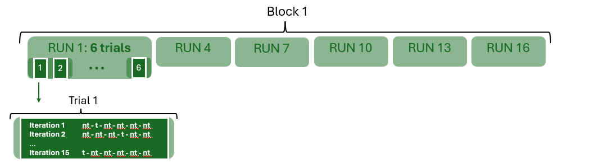
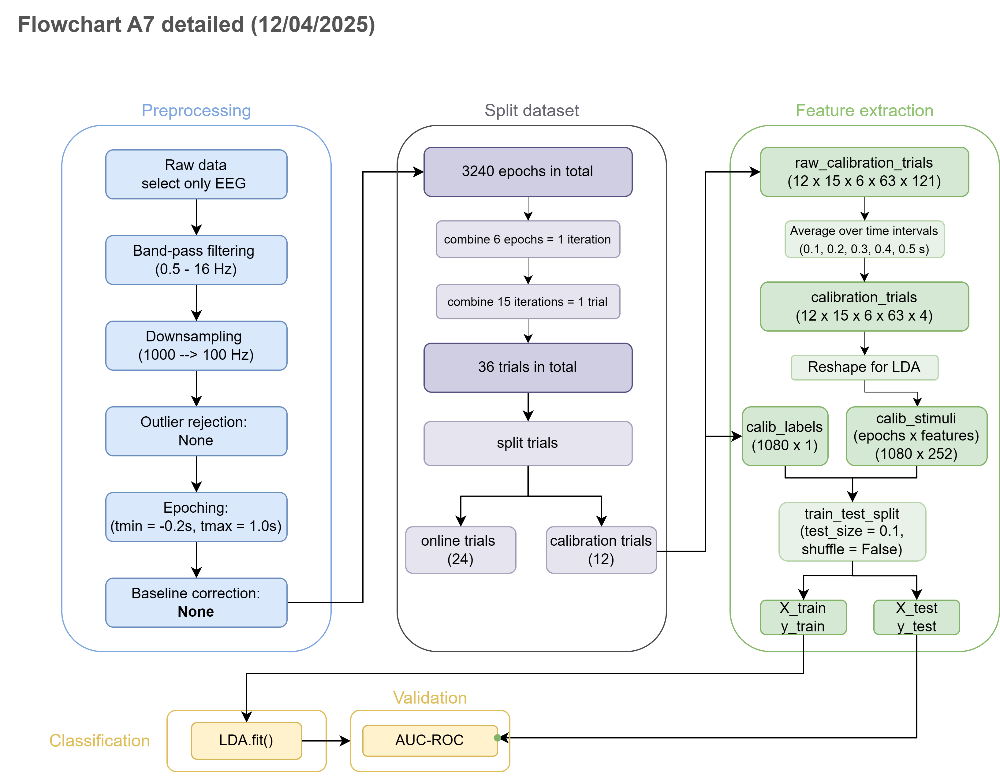

# Notes on dataset of assignment 7

To do:
- add source
- add preprocessing
- organize this file

## Experimental setup: Auditory aphasia paradigm

### Summary (bottom-up) 
- 6 words/stimuli per iteration
    - one is the target **t** and five are non-targets **nt**.
- 15 iterations form a single trial --> 6\*15 = 90 stimuli per trial
    - every trial has a single target word.
- 6 trials form a single run --> 6\*90 = 540 stimuli per run
- 6 runs form a block --> 6\*540 = 3240 stimuli in total

## Dataset
The dataset provided is only of block 1, and then the runs 1, 4, 7, 10, 13, and 16. Per run an .eeg, .vhdr, and .vmrk file is provided. The patient number is unknown

## Preprocessing (flowchart?)

- Preprocessing:
    - only EEG files are selected
    - Bandpass-filtering = (0.5, 16 Hz)
    - `raw.filter(*filter_band, method="iir")`
    - Baseline interval = [-0.2, 0] --> `None` 
    - Sampling rate 1000 Hz --> down sampled to 100 Hz
    - Outlier rejection: `None `

- Epochs:
    - tmin = -0.2 s 
    - tmax = 1.0 s 
    - 63 EEG channels x 4 time intervals = 252 features
    - 3240 epochs in total (see notes on dataset)

Last update: 12/04/2025

I am changing this all the time while working on the code. 

Eventually the final preprocessing will be added here.

.

.

.

.

.

.

## Source
To be added. 

Paper by Musso et al. 

Data preprocessing & description obtained from assignment 7 of the BCI course.

.

## To add later in the experimental setup
Dataset description
In every trial the patient has to focus on a single word from the set of 6 monosyllabic words, played on 6 speakers. The model has to decode the target word, i.e., which word the patient is attending to in that trial. To gather enough data for this task, the sequence of 6 words, a so-called *iteration*, is repeated 15 times. That means that there are 15 iterations in a single trial, adding up to 90 words/stimuli per trial. 

So, an iteration consists of 6 words: 5 non-targets and 1 target. Among iterations (within a trial) the target word is the same, but the order of words differ. 
15 iterations form a single trial. Per trial, the decoding model decides what the target word is. 6 trials form a single run. After each run, the patient can take a break. A single session/block consists of 6 runs.

.

## Copied from the BCI course's assignment 7:

#### Experimental setup:
In every trial the patient/user (from now on 'participant') has to focus on a single word from the set of 6 words. Each word/stimulus is played once per iteration. This means that an iteration consists of 6 words/stimuli, of which one is the target word. A sequence of 15 iterations, adding up to 90 stimuli, form one complete trial. The goal of a single trial is to determine what the target word is. This means that each iteration in a single trial shares the same target word. However, the order in which words are presented between iterations in a single trial may differ. To summarise, each trial has a single target word. Each trial consists of 15 iterations in which all 6 words are played once.

#### General EEG data information:
The data provided contains three file types: `.vhdr`, `.vmrk`, `.eeg`.  In the each `.vhdr` file you will find information about all recorded channels. Five of the channels listed are non-EEG channels:
* The EMG channel records an electromyogram. This is muscle activity.
* The GSR channel records the galvanic skin response. This is sweat gland activity which is indicative of stress levels and excitation.
* The Respi channel records respiration activity.
* The Pulse channel records the heart pulses by shining a red light on the finger and recording how much of it is reflected back.
* The Optic channel is an optical sensor focused on a portion of the screen that flashes every time an event happens in order to detect potential interference/delay between the time point the computer issues a stimulus and the time the stimulus is actually presented on the screen to the user.

Some of these channels can be used to remove artefacts from the EEG signal and better phase-locking the signals. For our experiment though they aren't relevant.

In the `.vhdr` files you will also find the resolution ( $\mu V$ steps) of each channel and the impedance (kOhm) of all channels, a higher impedance results in a higher noise level.

In each `.vmrk` you will find the event marker information. Each stimulus/event has an `event_id`. In our case, non-target words have event_ids $[101, 102, ..., 106]$. We have 6 different words. In every trial exactly 1 of them is in the target role. The target words are indicated by $[111,112, ..., 116]$. So, the last digit indicates the word id, the second digit indicates whether a stimulus is a target $(1)$ or non-target $(0)$.

Lastly, each `.eeg` file contains the recorded signals encoded in binary values and stored as integers. Increasing the value by 1 corresponds to a step value of 0.1 $\mu V$, which is the resolution denoted in the header (`.vhdr`) file.
