# A7 Experiments/Modifications Log

To do: 
- assign IDs to experiments?
- add instructions on how to navigate through this file
- make images smaller?
- rename images to exp ids

Experiment ideas:
- make classification per trial harder by changing feature extraction methods [online]
-
- Test sliding window on LDA with different window sizes
- Test sliding window on sLDA and BT-LDA
- Implement forgetting strategies from scratch (see notes) 
- See to do lists of previous experiments & notes


Overview 
- 📋**05/05/2025_Exp_11:** Compare AUC scores using smaller time intervals in feature extraction **[calibration]** (Exp 8 revisited)
- 📋**05/05/2025_Exp_10:** Compare AUC scores using different trial intervals with cross-validation **[calibration]** ✏️
- 📋**05/05/2025_Exp_9:** Compare AUC scores using different trial intervals with train_test_split **[calibration]**
- 
- 📋**29/04/2025_Exp_8:** Compare AUC of LDA vs sLDA vs BTLDA using smaller time intervals in feature extraction **[calibration]** 
- 🔧**25/04/2025_MDF_2:** Use K-folds cross-validation **[calibration]** 
- 📋**25/04/2025_Exp_7:** Compare AUC of LDA vs sLDA vs BTLDA using K-fold cross-validation instead of train_test_split **[calibration]** 
- 📋**25/04/2025_Exp_6:** Compare AUC of LDA vs sLDA vs BTLDA using different test_size values **[calibration]** 
- 📙**25/04/2025_Note_4:** Current train_test_split should change **[calibration]** 
- 📋**21/04/2025_Exp_5:** Implement first draft adaptive LDA: sliding window with different step sizes **[online]** ✏️
- 📋**21/04/2025_Exp_4:** Compare static LDA vs SLDA vs BT-LDA (using AUC-ROC curves, per epoch) **[online]** ✏️
- 📋**19/04/2025_Exp_3:** Compare AUC-scores of LDA vs SLDA vs BT-LDA **[calibration]** 
- 📙**18/04/2025_Note_3:** How accuracy is measured **[calibration]** (2/2) 
- 📋**14/04/2025_Exp_2:** Use TimeSeriesSplit **[calibration]** 
- 📙**14/04/2025_Note_2:** sklearn's TimeSeriesSplit: parameter max_train_size 
- 📙**13/04/2025_Note_1:** How accuracy is measured **[calibration]** (1/2)  
- 🔧**11/04/2025_MDF_1:** Turn off baseline correction 
- 📋**11/04/2025_Exp_1:** Effect of baseline correction on LDA **[calibration]** 

Legend
-
- 📋**day/month/year_Exp:** Experiment: *try out different things and look at the results, but do not change the the code*
- 📙**day/month/year_Note:** Notes
- 🔧**day/month/year_MDF:** Modifications: *change the code. This new setting holds for all experiments conducted after this modification*
- **[calibration]:** Calibration part. Here we use 12 calibration_trials (1080 epochs) and we split this into a train set and test set
- **[online]:** Online simulation part. Here we use 24 online_trials (2160 epochs) and the already trained classifier (using the train set of the calibration part)
- ✏️ : in progress


## 📅 New date template

### 📋 Exp / 📙 Note / 🔧 MDF 1: [Title]

**Goal**: ...

**Change:** ...

**Results:** ...

**Preprocessing/Settings:** ...

**Notes:** ...

**To do:** ...

---


## 📅 05/05/2025

### 📋 Exp 11: Compare AUC scores using smaller time intervals in feature extraction **[calibration]** 

**Goal**: Look at the effect of using different time intervals in feature extraction. Compare the AUC outcomes for each classifier with 4-fold cross-validation.

**Change**:
- current/old: time intervals of 100 ms (range 0.1-0.5)
- new : time intervals of 50 ms (range 0.1-0.5), 20 ms (range 0.1-0.5), and 10 ms (range 0.05-0.5)
 
**Results:** 
```
Using 4-fold cv - Time ivals of 100 ms:
Mean AUC score of LDA: 		 0.7716296296296297
Mean AUC score of sLDA: 	 0.7519506172839506
Mean AUC score of BT-LDA: 	 0.754320987654321

Using 4-fold cv - Time ivals of 50 ms:
Mean AUC score of LDA: 		 0.706641975308642
Mean AUC score of sLDA: 	 0.7656296296296295
Mean AUC score of BT-LDA: 	 0.7821234567901234

Using 4-fold cv - Time ivals of 20 ms:
Mean AUC score of LDA: 		 0.6559753086419753
Mean AUC score of sLDA: 	 0.7578024691358025
Mean AUC score of BT-LDA: 	 0.7852592592592593

Using 4-fold cv - Time ivals of 10 ms:
Mean AUC score of LDA: 		 0.6815802469135802
Mean AUC score of sLDA: 	 0.7589382716049383
Mean AUC score of BT-LDA: 	 0.7914320987654321
```

**Preprocessing/Settings:** 
- Preprocessing:
    - Bandpass-filtering = (0.5, 16 Hz)
    - `raw.filter(*filter_band, method="iir")`
    - Baseline interval = `None` 
    - Sampling rate 1000 Hz --> down sampled to 100 Hz
    - Outlier rejection: None 

- Epochs:
    - tmin = -0.2 s 
    - tmax = 1.0 s 
    - 63 EEG channels x 4 time intervals = 252 features
    - 1080 epochs used (out of 3240 epochs in total; see notes on dataset) 
    - the epochs were obtained from trials [0-12]

- Feature extraction
    - data was channel prime
    - averaged over time intervals --> experiment variable

- Method (how AUC was measured):
    - The mean auc-score was computed using 4-fold cross validation
    - See the A7_dump notebook for all code used in this experiment.

**Notes:** 
Note that for the time intervals of 10 ms, using `clf_ival_boundaries = np.arange(0.1,0.51,0.01)` gives an error of NaN values. Instead I use `clf_ival_boundaries = np.arange(0.05,0.51,0.01)` which gives no error. For the other time intervals of 100 ms, 50 ms, and 20 ms, `np.arange(0.1,0.51,x)` was used where x is the time interval size.

**To do:** (Optional) Implement a method that computes the AUC score using multiple samples, averaging over different trial interval samples

---

### 📋 Exp 10: Compare AUC scores using different trial intervals with cross-validation **[calibration]**

**Goal**: Look at the effect of using different intervals when sampling 12 trials from all trials. Compare the AUC outcomes with 4-fold cross-validation.

**Results:** 
```
4-fold cross-validation:

Using interval [0-12]
Mean AUC score of LDA: 		 0.7716296296296297
Mean AUC score of sLDA: 	 0.7519506172839506
Mean AUC score of BT-LDA: 	 0.754320987654321

Using interval [2-14]
Mean AUC score of LDA: 		 0.7591111111111111
Mean AUC score of sLDA: 	 0.7888641975308642
Mean AUC score of BT-LDA: 	 0.8002469135802469

Using interval [4-16]
Mean AUC score of LDA: 		 0.7821975308641975
Mean AUC score of sLDA: 	 0.796320987654321
Mean AUC score of BT-LDA: 	 0.8095061728395061

Using interval [6-18]
Mean AUC score of LDA: 		 0.8358271604938272
Mean AUC score of sLDA: 	 0.8452592592592593
Mean AUC score of BT-LDA: 	 0.861283950617284
```

**Preprocessing/Settings:** 
- Same as Exp 9
- Difference with Exp 9: Method (how AUC was measured):
    - The mean auc-score was computed using 4-fold cross-validation
    - See the A7_dump notebook for all code used in this experiment.

**Notes:** 
Note that the selected interval of trials matters. Selecting trials 0-12 yields different results than trials 2-14 or 4-16, even though they have the same dataset size. 

**To do:** (Optional) Implement a method that computes the AUC score using multiple samples, averaging over different trial interval samples

---

### 📋 Exp 9: Compare AUC scores using different trial intervals with train_test_split **[calibration]**

**Goal**: Look at the effect of using different intervals when sampling 12 trials from all trials. Compare the outcomes.

**Results:** 
```
AUC scores computed using a single train_test_split using trials [0:12] with test_size = 0.2
AUC LDA:  0.817746913580247
AUC SLDA:  0.8265432098765431
AUC BT-LDA:  0.8294753086419753

AUC scores computed using a single train_test_split using trials [2:14] with test_size = 0.2
AUC LDA:  0.8166666666666667
AUC SLDA:  0.8601851851851852
AUC BT-LDA:  0.8763888888888889

AUC scores computed using a single train_test_split using trials [4:16] with test_size = 0.2
AUC LDA:  0.7708333333333334
AUC SLDA:  0.7603395061728395
AUC BT-LDA:  0.7912037037037037
```

**Preprocessing/Settings:** 
- Preprocessing:
    - Bandpass-filtering = (0.5, 16 Hz)
    - `raw.filter(*filter_band, method="iir")`
    - Baseline interval = `None` 
    - Sampling rate 1000 Hz --> down sampled to 100 Hz
    - Outlier rejection: None 

- Epochs:
    - tmin = -0.2 s 
    - tmax = 1.0 s 
    - 63 EEG channels x 4 time intervals = 252 features
    - 1080 epochs used (out of 3240 epochs in total; see notes on dataset) 
    - the epochs were obtained from trials [0-12]

- Feature extraction
    - averaged over 4 time intervals: [0.1, 0.2, 0.3, 0.4, 0.5]
    - data was channel prime

- Method (how AUC was measured):
    - The mean auc-score was computed using a single train_test_split
    - See the A7_dump notebook for all code used in this experiment.

**Notes:** 
Note that the selected interval of trials matters. Selecting trials 0-12 yields different results than trials 2-14 or 4-16, even though they have the same dataset size. This variation in scores means that a single train_test_split is not a good evaluation method to measure the general performance. 

**To do:** 
- (Optional) Implement a method that computes the AUC score using multiple samples, averaging over different trial interval samples

---

## 📅 29/04/2025

### 📋 Exp 8: Compare AUC of LDA vs sLDA vs BTLDA using smaller time intervals in feature extraction **[calibration]**

**Goal**: Test the effect of smaller (and more) time intervals during feature extraction. Compute the new AUC scores of LDA, sLDA and BT-LDA and compare it to the current time intervals used.

**Change:** 
- current/old: `clf_ival_boundaries = np.array([0.1, 0.2, 0.3, 0.4, 0.5])` 
- new : `clf_ival_boundaries = np.array([0.05, 0.1, 0.15, 0.2, 0.25, 0.3, 0.35, 0.4, 0.45, 0.5])`
- I.e., instead of 4 time intervals of 100 ms each, we now use 9 time intervals of 50 ms each


**Results:** ...

```
# clf_ival_boundaries = np.array([0.1, 0.2, 0.3, 0.4, 0.5])
Using 4-fold cross-validation:
Mean AUC score of LDA:  0.7716296296296297
Mean AUC score of sLDA:  0.7519506172839506
Mean AUC score of BT-LDA:  0.754320987654321

# clf_ival_boundaries = np.array([0.05, 0.1, 0.15, 0.2, 0.25, 0.3, 0.35, 0.4, 0.45, 0.5])
Using 4-fold cross-validation:
Mean AUC score of LDA:  0.6906172839506173
Mean AUC score of sLDA:  0.7621234567901235
Mean AUC score of BT-LDA:  0.7828395061728395
```

**Preprocessing/Settings:** 

- Preprocessing:
    - Bandpass-filtering = (0.5, 16 Hz)
    - `raw.filter(*filter_band, method="iir")`
    - Baseline interval = `None` 
    - Sampling rate 1000 Hz --> down sampled to 100 Hz
    - Outlier rejection: None 

- Epochs:
    - tmin = -0.2 s 
    - tmax = 1.0 s 
    - 63 EEG channels x 4 time intervals = 252 features
    - 1080 epochs used (out of 3240 epochs in total; see notes on dataset) 
    - the epochs were obtained from trials [0-12]

- Feature extraction
    - averaged over 4 time intervals: [0.1, 0.2, 0.3, 0.4, 0.5]
    - data was channel prime

- Method (how AUC was measured):
    - The mean auc-score was computed using 4-fold cross validation
    - See the A7_dump notebook for all code used in this experiment.


**Notes:** 

- The chosen time intervals should be all of equal size as required for Block-Toeplitz LDA (for more info see [Sosulski & Tangermann, 2022](https://iopscience.iop.org/article/10.1088/1741-2552/ac9c98/meta))
- The expectation was that the regularized versions of LDA would perform better than normal LDA when the data features increase, with the best results for BT-LDA. This is indeed the case. However, the amount of data used here is so little that the results are not considered reliable.

---
## 📅 25/04/2025

### 🔧 MDF 2: Use K-fold cross-validation [calibration]

**Modification:** Use K-fold cross-validation instead of train_test_split to measure a classifier's AUC score on calibration data.

**Notes:**  Cross-validation is more robust than a single train_test_split, especially with small datasets. For a single train_test_split, you get varying outcomes, depending on which interval you take from all trials (See Exp 9). Note that cross-validation does violate the chronological order of the data, but if you take big enough chunks and do not shuffle within these chunks, it should be acceptable.

---

### 📋 Exp 7: Compare AUC of LDA vs sLDA vs BTLDA using K-fold cross-validation instead of train_test_split **[calibration]**

**Goal**: Use K-fold cross-validation to measure the AUC score of LDA vs sLDA vs BT-LDA on the calibration data. Compare it with the auc scores obtained from a single train test split

**Change:** Before, train_test_split was used to compute the auc score of a classifier on the calibration data. Now cross-validation will be used instead. In this experiment 4-fold cv was used.

**Results:** ...

```

Using 4-fold cross-validation:
AUC score of LDA, all 4 folds:  [0.75130864 0.712      0.8237037  0.79950617]
Mean AUC score of LDA:  0.7716296296296297
AUC score of sLDA, all 4 folds:  [0.74182716 0.64187654 0.7897284  0.83437037]
Mean AUC score of sLDA:  0.7519506172839506
AUC score of BT-LDA, all 4 folds:  [0.73491358 0.64849383 0.79861728 0.83525926]
Mean AUC score of BT-LDA:  0.754320987654321

Using single train test split:
AUC scores computed using a single train_test_split with test_size = 0.2
AUC LDA:  0.817746913580247
AUC SLDA:  0.8265432098765431
AUC BT-LDA:  0.8294753086419753

```

**Preprocessing/Settings:** 

- Preprocessing:
    - Bandpass-filtering = (0.5, 16 Hz)
    - `raw.filter(*filter_band, method="iir")`
    - Baseline interval = `None` 
    - Sampling rate 1000 Hz --> down sampled to 100 Hz
    - Outlier rejection: None 

- Epochs:
    - tmin = -0.2 s 
    - tmax = 1.0 s 
    - 63 EEG channels x 4 time intervals = 252 features
    - 1080 epochs used (out of 3240 epochs in total; see notes on dataset) 
    - the epochs were obtained from trials [0-12]

- Feature extraction
    - averaged over 4 time intervals: [0.1, 0.2, 0.3, 0.4, 0.5]
    - data was channel prime

- Method (how AUC was measured):
```
    clf_lda = make_pipeline(LDA(),)
    auc_lda = cross_val_score(clf_lda, X, y, cv=cv_folds, scoring = 'roc_auc')
```
See the A7_dump notebook for all the code that was used in this experiment.

**Notes:** 

- Note that cross-validation does violate the rule to respect the chronological order of the data, but if you take big enough chunks and do not shuffle within these chunks, it should be acceptable.

---

### 📋 Exp 6: Compare AUC of LDA vs sLDA vs BTLDA using different test_size values [calibration]

**Goal**: Use different test sizes when splitting the calibration data with `train_test_split`. Then check the AUC scores of LDA, sLDA and BT-LDA

**Change:** `train_test_split` with `test_size = 10%` --> `test_size = 20%` and `test_size = 30%`

**Results:** 

Using `test_size = 0.1`
```
LDA scores with channel prime data
roc_auc:  0.8197530864197531
bal_acc_auc:  0.7333333333333334

sLDA scores with channel prime data
roc_auc:  0.8117283950617283
bal_acc_auc:  0.6444444444444445

BT LDA scores with channel prime data
roc_auc:  0.8253086419753086
bal_acc_auc:  0.65
```

Using `test_size = 0.2`
```
LDA scores with channel prime data
roc_auc:  0.817746913580247
bal_acc_auc:  0.7166666666666667

sLDA scores with channel prime data
roc_auc:  0.8265432098765431
bal_acc_auc:  0.575

BT LDA scores with channel prime data
roc_auc:  0.8294753086419753
bal_acc_auc:  0.6027777777777777
```
Using `test-size = 0.3`
```
LDA scores with channel prime data
roc_auc:  0.7780521262002743
bal_acc_auc:  0.6537037037037037

sLDA scores with channel prime data
roc_auc:  0.8282578875171468
bal_acc_auc:  0.5685185185185185

BT-LDA scores with channel prime data
roc_auc:  0.8244170096021949
bal_acc_auc:  0.5685185185185185
```
The ROC curves of all three conditions can be found below:

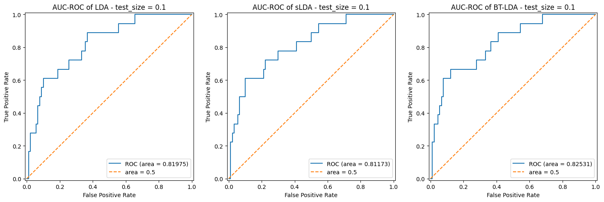
*Figure 1. AUC-ROC using train_test_split with test_size = 0.1*

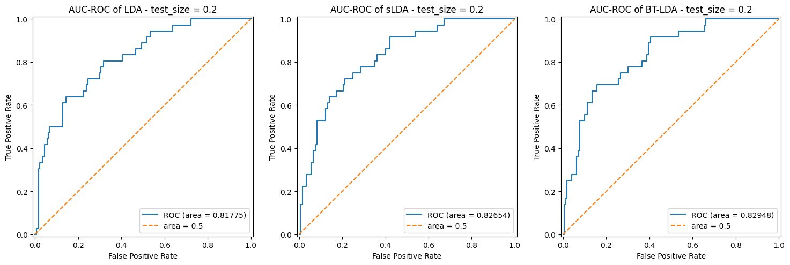
*Figure 2. AUC-ROC using train_test_split with test_size = 0.2*

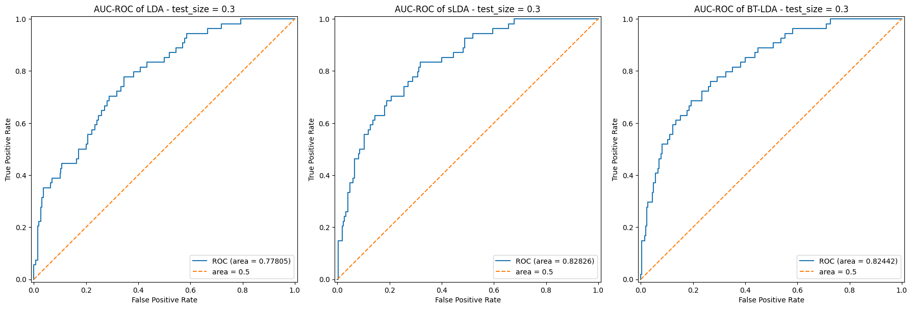
*Figure 3. AUC-ROC using train_test_split with test_size = 0.3*

**Preprocessing/Settings:** 

- Preprocessing:
    - Bandpass-filtering = (0.5, 16 Hz)
    - `raw.filter(*filter_band, method="iir")`
    - Baseline interval = `None` 
    - Sampling rate 1000 Hz --> down sampled to 100 Hz
    - Outlier rejection: None 

- Epochs:
    - tmin = -0.2 s 
    - tmax = 1.0 s 
    - 63 EEG channels x 4 time intervals = 252 features
    - 1080 epochs used (out of 3240 epochs in total; see notes on dataset) 
    - the epochs were obtained from trials [0-12]

- Feature extraction
    - averaged over 4 time intervals: [0.1, 0.2, 0.3, 0.4, 0.5]
    - data was channel prime

- Method: see A7_dump notebook for all code used

---


### 📙 Note 4: Current train_test_split should change **[calibration]**

**Notes:** 
- The current method used to split the calibration data into a train and test set to then measure the AUC score, is with `train_test_split` 
- This method was discussed earlier in Note 1, where it became clear that this method is not really robust. Currently, we are splitting the dataset of 1080 epochs (i.e., the 12 `calibration_trials`) only once, with a train/test ratio of 90/10. Especially the size of the test set (+/- 100 epochs) is so small that the AUC score will not be reliable.

**To do:** 
- In Exp 6 we will use a train/test ratio of 80/20 and 70/30 and measure the AUC score.
- In Exp 7 we will replace the single `train_test_split` by a K-fold cross validation

---

## 📅21/04/2025

### 📋 Exp 5: Implement first draft adaptive LDA: sliding window with different step sizes **[online]**

**Goal**: Compare sliding window adaptation with different step sizes: update lda every 100, 10 and 1 epoch(s).

**Notes**: The same classifiers from Exp 3 are used here. 

**Results:** 

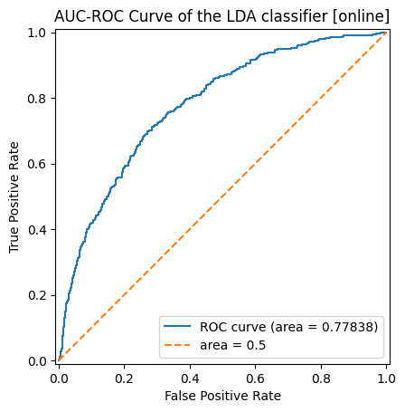
*Figure 1. AUC-ROC static LDA online*

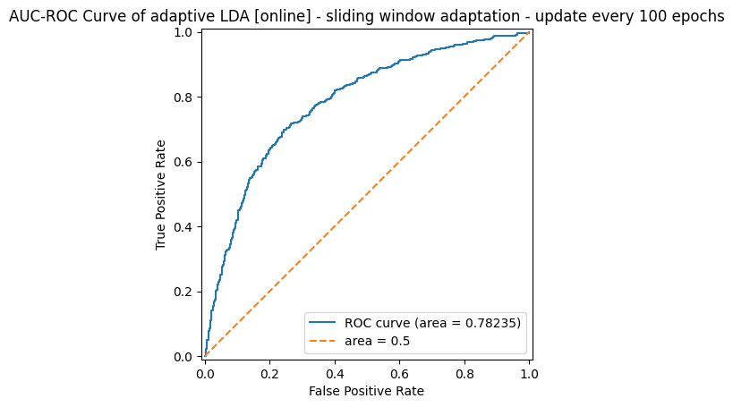
*Figure 2. AUC-ROC adaptive LDA online - sliding window with step size 100*

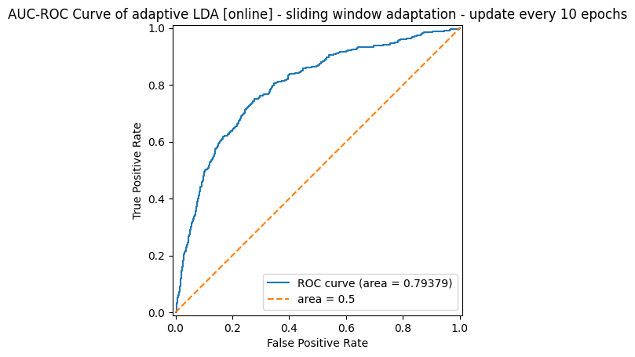
*Figure 3. AUC-ROC adaptive LDA online - sliding window with step size 10*

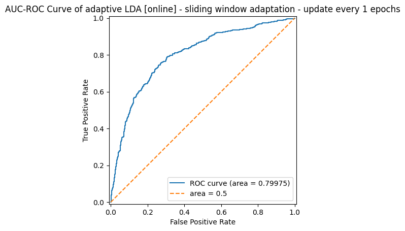
*Figure 3. AUC-ROC adaptive LDA online - sliding window with step size 1*

**Preprocessing/Settings:** ...

**Notes:** ...

**To do:** ...

---

### 📋 Exp 4: Compare static LDA vs SLDA vs BT-LDA (using AUC-ROC curves, per epoch) **[online]** 

**Goal**: Compare the AUC scores of LDA, sLDA and BT-LDA on the trials that we have reserved for online simulation.

**Notes**: The same classifiers from Exp 3 are used here. No updating was done here.

**Results:** 


*Figure 1. AUC-ROC static LDA online*

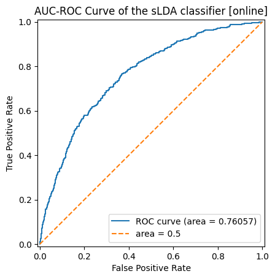
*Figure 2. AUC-ROC static sLDA online*

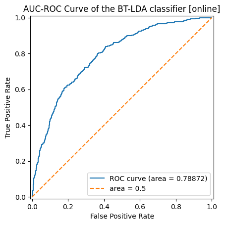
*Figure 3. AUC-ROC static BT-LDA online*

**Preprocessing/Settings:** 

- Preprocessing is exactly the same as in Exp_3
- Evaluation (how AUC was measured): See A7_dump for the code
---

## 📅 19/04/2025

### 📋 Exp 3b: Compare AUC scores of LDA vs SLDA vs BT-LDA using another method **[calibration]**

**Goal**: Compare ROC AUC scores of LDA, sLDA and BT-LDA on the calibration data, using the evaluation method of assignment 7, ex. 3

**Results:** 


*Figure: AUC using train_test_split with test_size = 0.1*

**Preprocessing/Settings:** Same as 19/04/2025_Exp_1a

### 📋 Exp 3a: Compare AUC scores of LDA vs SLDA vs BT-LDA using Jan's method **[calibration]**

**Goal**: Compare ROC AUC scores of LDA, sLDA and BT-LDA on the calibration data. The evaluation method of Jan's `example_toeplitz_lda_simply.py` script was used.

**Change:** Some things had to be changed as required for BT-LDA. See 'Preprocessing/Settings'. 

**Results:** 

```
LDA scores with channel prime data
roc_auc:  0.8197530864197531
bal_acc_auc:  0.7333333333333334

sLDA scores with channel prime data
roc_auc:  0.8117283950617283
bal_acc_auc:  0.6444444444444445

BT LDA scores with channel prime data
roc_auc:  0.8253086419753086
bal_acc_auc:  0.65
```

**Preprocessing/Settings:** 
- The data had to be reshaped to be channel-prime (required for BT-LDA). This did not change the ROC curve / AUC score of LDA or sLDA. See 19/04/2025_Exp_2 for the results when turning off the channel-prime order

- Preprocessing:
    - Bandpass-filtering = (0.5, 16 Hz)
    - `raw.filter(*filter_band, method="iir")`
    - Baseline interval = `None` 
    - Sampling rate 1000 Hz --> down sampled to 100 Hz
    - Outlier rejection: None 

- Epochs:
    - tmin = -0.2 s 
    - tmax = 1.0 s 
    - 63 EEG channels x 4 time intervals = 252 features
    - 1080 epochs used (out of 3240 epochs in total; see notes on dataset)

- Feature extraction
    - averaged over 4 time intervals: [0.1, 0.2, 0.3, 0.4, 0.5]
    - data split into X_train, X_test, y_train, y_test using `train_test_split` with `test_size = 0.1` 
- Evaluation (how AUC was measured): see A7_dump notebook

**Notes:** ...

**To do:** 

- (Optional) test effect of turning off channel-prime order
- (Optional) consider other ways to compute AUC
- (Optional) consider other evaluation methods?

---

### 📙 Note 3: How accuracy is measured [calibration] (2/2)

The accuracy is measured with sklearn's method [metrics.roc_curve](https://scikit-learn.org/stable/modules/generated/sklearn.metrics.roc_curve.html):

    ```
    fpr, tpr, thresholds = metrics.roc_curve(y_test,clf.decision_function(X_test)) 
    ```
  
See comments in jupyter notebook for more details on the function

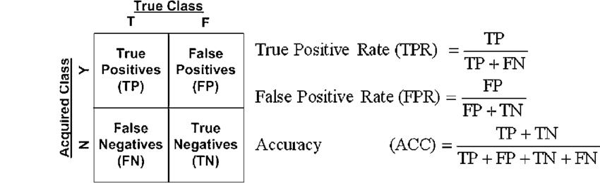

**Notes:**
- Note that the length of fpr and tpr is equal to the number of unique values obtained. This means that for one subset of the data, tpr could be of size 30 for instance, while for another subset of the same size, the fpr could be 27. 

---

## 📅 14/04/2025

### 📋 Exp 2: Use TimeSeriesSplit **[calibration]**

**Goal:** Use k-folds cv instead of a single train/test split & at the same time respect the chronological order.

**Change:** single train_test_split (no cv) --> [TimeSeriesSplit](https://scikit-learn.org/stable/modules/cross_validation.html#time-series-split) (cv)

**Results:**
I have decided not to average over folds for better visualization

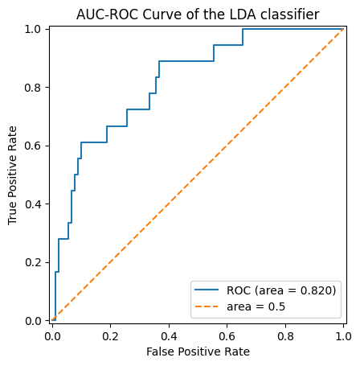
*Figure 1. AUC train_test_split*

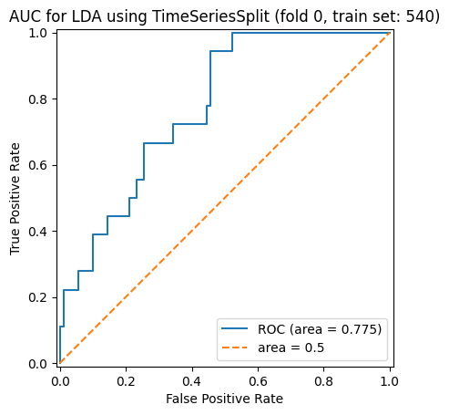
*Figure 2. AUC TimeSeriesSplit fold 0*

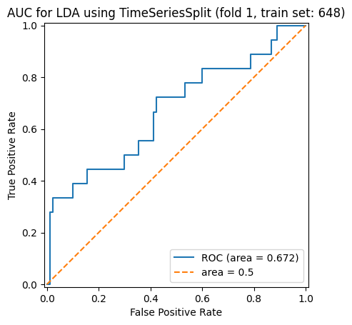
*Figure 3. AUC TimeSeriesSplit fold 1*

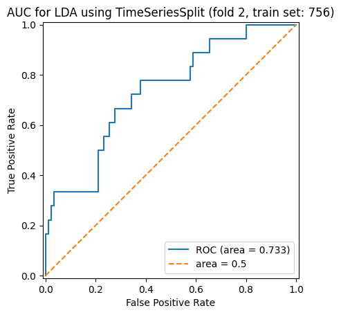
*Figure 4. AUC TimeSeriesSplit fold 2*

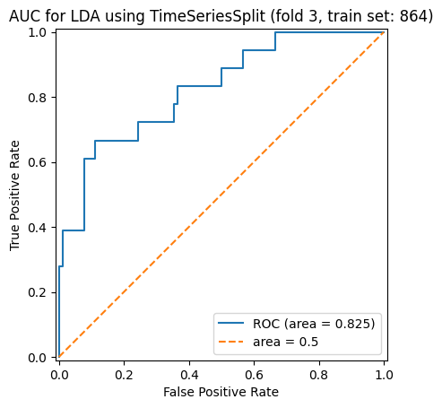
*Figure 5. AUC TimeSeriesSplit fold 3*

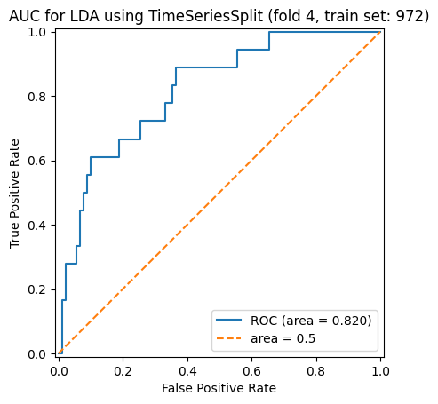
*Figure 6. AUC TimeSeriesSplit fold 4*

**Preprocessing/Settings:**
- test_size was kept the same for both train_test_split and TimeSeriesSplit (test size = 10%).
- same preprocessing as in 11/04/2025, with baseline correction set to `None`.
- 1080 epochs were used for this experiment (out of 3240. The other 2160 are used for online simulation)

train_test_split
```
X_train, X_test, y_train, y_test = train_test_split(calibration_stimuli, calibration_labels, test_size=0.1, shuffle=False)
```

TimeSeriesSplit
```
X = calibration_stimuli
test_size = int(0.1 * len(X)) 
timeseriescv = TimeSeriesSplit(gap=0, max_train_size=None, n_splits=5, test_size=test_size)
```

**Notes:**
- See (13/04/2025 Note 1), [train_test_split](https://scikit-learn.org/stable/modules/generated/sklearn.model_selection.train_test_split.html) and [TimeSeriesSplit](https://scikit-learn.org/stable/modules/cross_validation.html#time-series-split) for more info.
- My understanding is that TimeSeriesSplit is the same as a rolling k-fold cross-validation. "Unlike cross-validation methods, successive training sets are supersets of those that come before them." [[TimeSeriesSplit documentation]](https://scikit-learn.org/stable/modules/generated/sklearn.model_selection.TimeSeriesSplit.html#sklearn.model_selection.TimeSeriesSplit)
- The final fold of TimeSeriesSplit is exactly the same as the result of train_test_split. All previous folds have a worse performance, except from fold 4... Maybe it is actually not better to replace train_test_split by TimeSeriesSplit? 

---

### 📙 Note 2: sklearn's TimeSeriesSplit: parameter max_train_size 

**Topic**: Setting max_train_size to `None` looks like cv on a rolling basis. Setting max_train_size to another value, looks the same as the function in A6 that computes the AUC for different dataset sizes, using multiple samples per size 

**Change:** max_train_size = `None` vs max_train_size = 4

**Results:** 
```
TimeSeriesSplit(gap=0, max_train_size=None, n_splits=5, test_size=None)
Fold 0:
  Train: index=[0 1]
  Test:  index=[2 3]
Fold 1:
  Train: index=[0 1 2 3]
  Test:  index=[4 5]
Fold 2:
  Train: index=[0 1 2 3 4 5]
  Test:  index=[6 7]
Fold 3:
  Train: index=[0 1 2 3 4 5 6 7]
  Test:  index=[8 9]
Fold 4:
  Train: index=[0 1 2 3 4 5 6 7 8 9]
  Test:  index=[10 11]
```

```
TimeSeriesSplit(gap=0, max_train_size=4, n_splits=5, test_size=None)
Fold 0:
  Train: index=[0 1]
  Test:  index=[2 3]
Fold 1:
  Train: index=[0 1 2 3]
  Test:  index=[4 5]
Fold 2:
  Train: index=[2 3 4 5]
  Test:  index=[6 7]
Fold 3:
  Train: index=[4 5 6 7]
  Test:  index=[8 9]
Fold 4:
  Train: index=[6 7 8 9]
  Test:  index=[10 11]
```

**To do:** 
- Maybe I can use this for the forgetting strategy with a sliding window / binary cutoff

---

## 📅 13/04/2025

### 📙 Note 1: How accuracy is measured [calibration] (1/2)

**Topic:** How the calibration data is split into a train and test set to measure LDA's accuracy

**Notes:**

- The accuracy (see 11/04/2025 Exp 1) is measured as follows:
    ```
    X_train, X_test, y_train, y_test = train_test_split(calibration_stimuli, calibration_labels, test_size=0.1, shuffle=False)
    clf = LDA().fit(X_train, y_train)

    fpr, tpr, thresholds = metrics.roc_curve(y_test,clf.decision_function(X_test)) 
    ```
- sklearn's method [train_test_split](https://scikit-learn.org/stable/modules/generated/sklearn.model_selection.train_test_split.html) is used to split the calibration data into a training set and test set. 
- If shuffle is `True`: the train & test set are picked randomly & not (chronologically) ordered. This is problematic in our case. The relationship between the data points x and their corresponding label y remains unchanged, however.
- If shuffle is `False`, the train/test set is selected in chronological order. This means that when having 100 data points and the train set is 80%, then the first 80 data points are selected. It's good that the chronological order remains, but is it reliable to base off the accuracy on only one sample of [0-80]? We could also take [10-90], or [20-100]. Even better would be cross-validation, but we should respect the chronological order. Nevertheless, a K-fold cross validation might still be better. This will be revisited in 25/04/2025.

**To do:**
- (Optional) Test if/how taking different sample intervals for the train_test_split would affect the accuracy.
- Use sklearn's solution for time series data:  [TimeSeriesSplit](https://scikit-learn.org/stable/modules/cross_validation.html#time-series-split) 

---


## 📅  11/04/2025

### 🔧  MDF 1: Turn off baseline correction

**Modification:** Turn off baseline correction in the preprocessing steps.

### 📋  Exp 1: Effect of baseline correction on LDA [calibration]

**Goal:** Test the effect of baseline correction on LDA in calibration

**Change:** changed basline [-0.2, 0 s] --> `None`

**Results:** Accuracy LDA: baseline - 0.799 %, no baseline = 0.820

Important note on results: the AUC score here is not really reliable... It depends on the chosen interval of trials.


*Figure 1. AUC without baseline-correction*

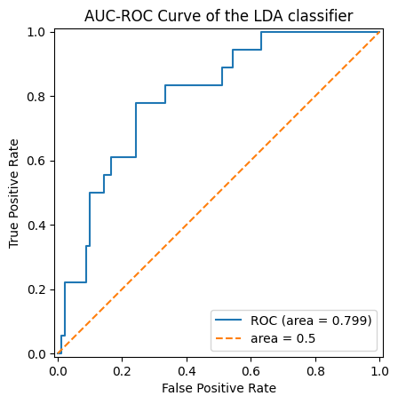
*Figure 2. AUC with baseline-correction*

**Preprocessing/Settings:**    
- Preprocessing:
    - Bandpass-filtering = (0.5, 16 Hz)
    - `raw.filter(*filter_band, method="iir")`
    - Baseline interval = [-0.2, 0] or `None` 
    - Sampling rate 1000 Hz --> down sampled to 100 Hz
    - Outlier rejection: None 

- Epochs:
    - tmin = -0.2 s 
    - tmax = 1.0 s 
    - 63 EEG channels x 4 time intervals = 252 features
    - 1080 epochs used (out of 3240 epochs in total; see notes on dataset)

- Evaluation (how accuracy was measured):
```
X_train, X_test, y_train, y_test = train_test_split(calibration_stimuli, calibration_labels, test_size=0.1, shuffle=False)
clf = LDA().fit(X_train, y_train)

fpr, tpr, thresholds = metrics.roc_curve(y_test,clf.decision_function(X_test)) # Compute signed distance of stimulus to decision boundary
auc_fig = metrics.RocCurveDisplay(fpr=fpr, tpr = tpr)
auc_fig.plot()
plt.plot([0, 1],[0,1], '--')
plt.legend(['ROC (area = %0.3f)' % metrics.auc(fpr, tpr), 'area = 0.5'], loc="lower right")
plt.title("AUC-ROC Curve of the LDA classifier")
plt.show()
```


**Notes:** 
- In the original file, there was no baseline parameter given. When epochs are extracted with ` epoch = mne.Epochs(...)`, the epochs have a standard baseline correction of [-0.2, 0 s] (Default of mne.Epochs)
- I added `baseline = None`, so now that line is changed to `    epoch = mne.Epochs(..., baseline=None)` 
- This should be advantegous for BT-LDA, but it also appeared better for normal LDA (see results).
- The AUC score here is not really reliable... It depends on the chosen interval of trials.

**To do:**
- Check this effect on Block-Toeplitz LDA

---
